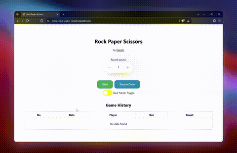
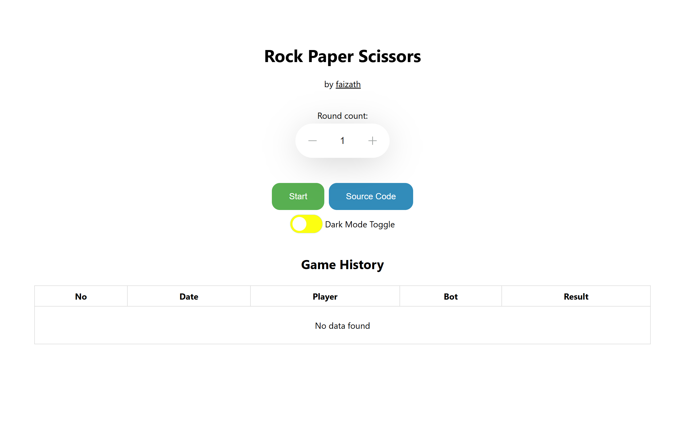
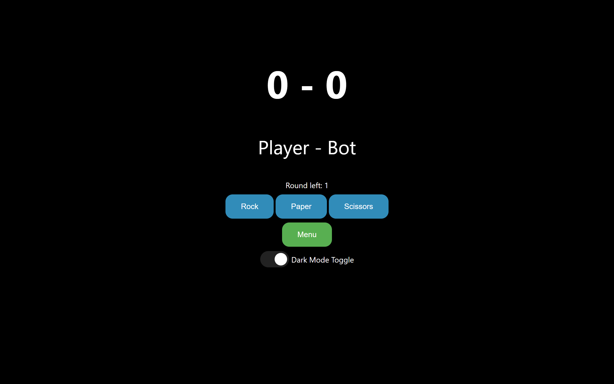
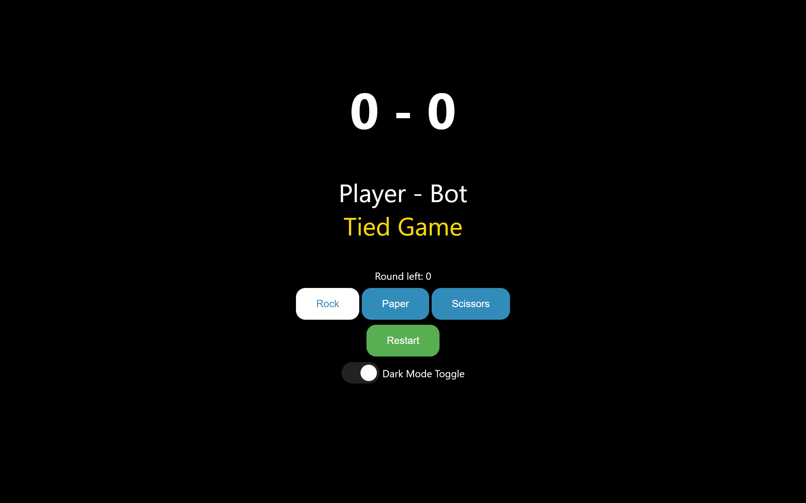
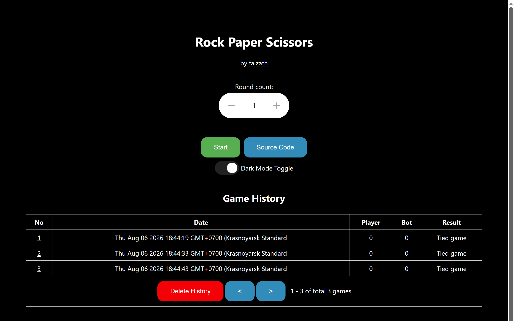
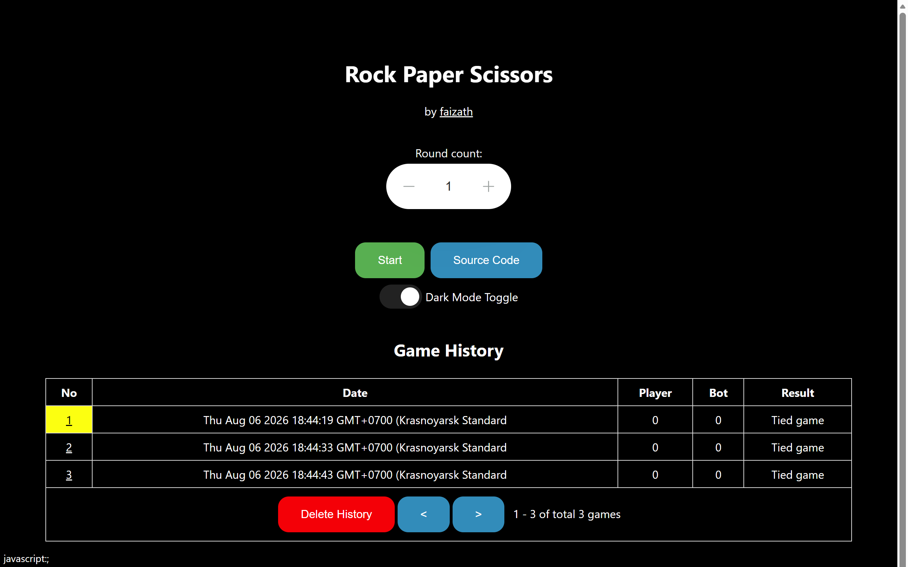
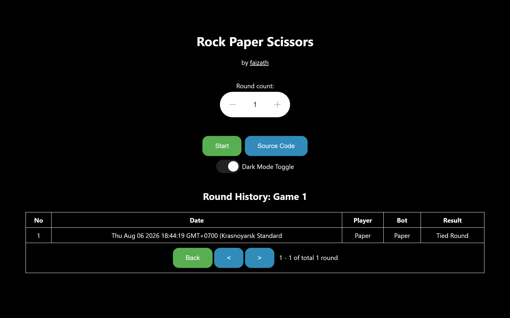
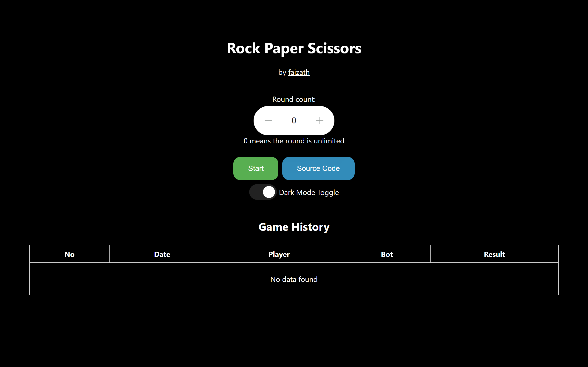

<div align="center">

# 🪨 Rock Paper Scissors 📄✂️

**A no-build, no-dependency Rock Paper Scissors game — three files of plain HTML, CSS, and JavaScript.**

[](#-about-this-project)
[](src/js/script.js)
[](#-project-structure)

[**▶ Play it live**](https://rock-paper-scissors.faizath.com) · [**Source**](https://github.com/faizath/rock-paper-scissors) · [**Report a bug**](https://github.com/faizath/rock-paper-scissors/issues)

</div>

---

## 🏆 About This Project

This game was built as the **Small Assignment Project for Crew Member Candidates of Amateur Radio Club ITB 2023**. The brief was deliberately narrow: build a working Rock Paper Scissors game using nothing but vanilla HTML, CSS, and JavaScript — no frameworks, no build tools, no libraries.

It was **honored as one of the 2 Best Small Projects** of the Crew Member Candidates of Amateur Radio Club ITB 2023.

Rather than stopping at a three-button coin flip, this implementation treats the constraint as the interesting part. Everything you would normally reach for a framework to do — screen transitions, persistent state, theming, a paginated history browser with drill-down — is done with the platform itself: CSS transitions, `localStorage`, and about 380 lines of dependency-free JavaScript.

**No build step. No `npm install`. No backend.** Clone it and open `index.html`.

## 🎬 Demo

<div align="center">
  
</div>

> A higher-quality version of this recording is available at [`assets/demo.mp4`](assets/demo.mp4).

## ✨ Features

- **🎯 Best-of-N rounds** — pick your round count with a custom stepper, or set it to `0` for **unlimited mode**, which swaps in an *End Game* button so you decide when to stop.
- **📊 Live scoreboard** — running Player–Bot score with each round's outcome announced beneath it, punctuated by a blink animation.
- **📜 Persistent game history** — every finished game is recorded with its date, final score, and result.
- **🔍 Round-by-round drill-down** — click any game's number in the history table to see every individual round of that game.
- **📄 Pagination** — both history views page through 10 entries at a time, with a live `1 - 10 of total N games` counter.
- **🌗 Dark & light theme** — follows your system's `prefers-color-scheme` on first visit, then remembers whatever you choose.
- **💾 Zero-backend persistence** — scores, history, and theme all live in `localStorage`. No accounts, no server, nothing leaves your browser.
- **🫨 Tactile validation** — try to decrement the round count below zero and the input shakes at you.
- **📱 Responsive** — single fluid column that works from phone to desktop.

## 📸 Screenshots

<table>
  <tr>
    <td width="50%" align="center">
      <br>
      <sub><b>1 · Main menu</b><br>Round picker and an empty history table.</sub>
    </td>
    <td width="50%" align="center">
      <br>
      <sub><b>2 · Dark mode</b><br>The same menu with the theme toggled.</sub>
    </td>
  </tr>
  <tr>
    <td width="50%" align="center">
      <br>
      <sub><b>3 · In-game</b><br>Scoreboard, rounds remaining, and your three moves.</sub>
    </td>
    <td width="50%" align="center">
      <br>
      <sub><b>4 · Game over</b><br>Result called in gold; moves lock and <i>Menu</i> becomes <i>Restart</i>.</sub>
    </td>
  </tr>
  <tr>
    <td width="50%" align="center">
      <br>
      <sub><b>5 · Game history</b><br>Past games with pagination and <i>Delete History</i>.</sub>
    </td>
    <td width="50%" align="center">
      <br>
      <sub><b>6 · Hover state</b><br>Rows highlight to show they drill down.</sub>
    </td>
  </tr>
  <tr>
    <td width="50%" align="center">
      <br>
      <sub><b>7 · Round history</b><br>Every round of one game, with both moves.</sub>
    </td>
    <td width="50%" align="center">
      <br>
      <sub><b>8 · Unlimited mode</b><br>Setting the count to <code>0</code> removes the round limit.</sub>
    </td>
  </tr>
</table>

## 🚀 Running It Locally

```bash
git clone https://github.com/faizath/rock-paper-scissors.git
cd rock-paper-scissors
```

Then either open `index.html` directly in your browser, or serve the folder:

```bash
python3 -m http.server 8000
# then visit http://localhost:8000
```

Both work — the game has no dependencies and no build step. Opening the file over `file://` is fine, since `localStorage` is the entire persistence layer.

To wipe your saved data, use the in-app **Delete History** button, or clear the `theme`, `gameLog`, `roundLog`, and `scoreLog` keys from `localStorage`.

## 📁 Project Structure

```
rock-paper-scissors/
├── index.html          # Both screens live here — menu and game
├── src/
│   ├── css/style.css   # Theming, animations, and layout
│   └── js/script.js    # Game logic, history, persistence
└── assets/             # Demo recordings and screenshots
```

That's the whole application. Three files.

## 🧠 How It Works

A few decisions are worth calling out, since they're what the framework would normally have handled for you:

**One document, two screens.** The menu and the game board both exist in the DOM at all times. "Navigation" is purely CSS — the menu overlay animates its `width` to `0` and fades out, revealing the game beneath it. There is no router and no view teardown.

**The DOM is the state.** There is no game-state object. The current scores, the rounds remaining, and even whether the last game finished are all read back out of the elements that display them. Unlimited mode is encoded as the `∞` character in the rounds-left label.

**Four `localStorage` keys** carry everything across sessions:

| Key | Holds |
|---|---|
| `theme` | `light` or `dark`, applied before first paint to avoid a flash |
| `scoreLog` | the in-progress game's running score |
| `gameLog` | every finished game — date, final score, result |
| `roundLog` | array-of-arrays; `roundLog[gameNo - 1]` is that game's rounds |

That last pairing is what makes the drill-down work: the two logs are index-aligned, so a game's number is also the key to its rounds.

---

<div align="center">

Built by [**faizath**](https://github.com/faizath)

</div>
